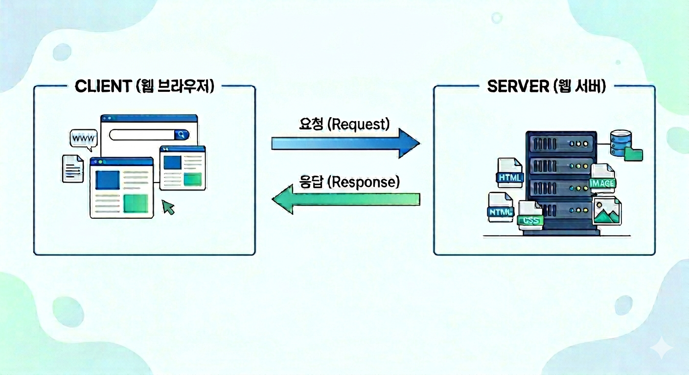

# Chapter 1: Intro

## 이번 Chapter에서 할 것

HTML Page를 직접 만들어본다.  
HTML, CSS, JavaScript의 개념 이해
AI Chat을 활용하여 계산기 web page 만들기
---

## Web Site란?

인터넷에 Contents가 게시되어 있는 장소이며 Web Browser를 통해 접속할 수 있다.  

Web site는 **server**와 **client**가 서로 요청하고 응답하며 동작한다.

- **Server:** Web Site의 내용이 보관되어 있다. client로부터 요청이 오면 파일을 전송한다.
- **Client:** Web Site에 파일을 요청하고 전송 받은 code를 browser에서 실행한다.
  
Web browser의 주소창에 URL(Uniform Resource Locator)을 입력하면,  
server가 파일(code)을 보내주고, browser가 실행한다.  

  

---

Web Browser를 통해 보는 한 화면을 Web Page라고 한다.

## 🏗️ Web Page의 언어, HTML (HyperText Markup Language)

Browser가 읽는 파일의 형식이 **HTML**이다.  
Web page는 모두 HTML code로 만들어진다. (website에서 HTML code를 직접 확인해보자)

VSCode에서 `index.html` 파일을 만들고 아래 내용을 작성하고 파일을 실행시켜보자.
(web browser에서 실행)

```html
<!DOCTYPE html>
<html>
  <head>
    <title>내 첫 페이지</title>
  </head>
  <body>
    <h1>안녕하세요</h1>
    <p>이게 web page입니다.</p>
  </body>
</html>
```

> 💡 Browser는 이 HTML 파일을 읽고 화면에 그려준다.  
> 우리가 보는 모든 web page가 이런 형식으로 이루어져 있다.

---
## 🎨 Web Page의 Design, CSS

HTML만으로는 디자인을 표현하기 어렵다.  
CSS를 사용하면 color, 배경, layout 등을 자세하게 설정할 수 있다.

- 각 element의 색상, 배경색, 버튼 모양, 레이아웃 정렬등을 설정한다.
- `<style>` tag를 이용하여 작성한다.

> 💡 아래 계산기 실습에서 확인해보자.

---
## 🧠 Web Page의 작동 JavaScript

JavaScript는 Web Page가 작동할 수 있게 만든다.

- Button을 click하거나 특정 이벤트가 일어나면 해야하는 동작을 지정한다.
- `<script>` tag를 이용하여 작성한다.

> 💡 아래 계산기 실습에서 확인해보자.

---

## 계산기 Web Page 만들기

AI Chat을 이용하여 사칙연산이 가능한 계산기 web page를 만들어 보자.   
(각 단계별로 html code를 확인하고 HTML + CSS + JavaScript가 어떤 역할을 하는지 확인한다.)


- **1단계: Layout 만들기** (HTML tag 이해)

    ```
    사칙연산 계산기를 만들거야. 기본 HTML만 작성해줘!
    ```

- **2단계: CSS로 design 완성하기** (style tag)

    ```
    위에서 만든 계산기에 CSS를 이용하여 세련되게 만들어줘! (구체적인 style을 제시하기)
    ```

- **3단계: JavaScript로 기능 추가하기** (function)

    ```
    Button이 작동하는 실제 기능의 JavaScript를 추가해줘!
    ```

---

## 정리

Web Page : HTML + CSS + JavaScript

하지만 지금까지 만든 web page는 모두 내 컴퓨터(local)에서만 볼 수 있다.

다음 Chapter에서는 web page를 인터넷으로 옮기고,  
Study blog를 게시할 수 있는 website를 만들어 보자. 