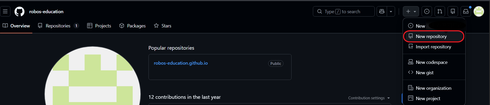
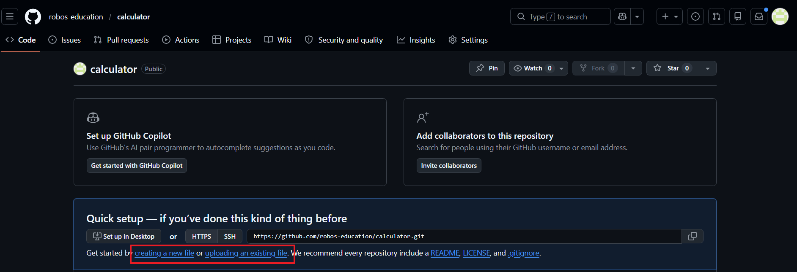

# GitHub 가입 · Repository 생성 · 웹 페이지 배포


GitHub에 가입하고, 파일을 올리고, 실제 URL로 접근한다.
지난 Chapter에서 작성한 01_calcu_03.html을 배포한다.

---

## 1. GitHub 가입

[github.com](https://github.com)

1. **Sign up** 클릭
2. 이메일 주소 입력
3. 비밀번호 설정
4. username 입력 (영문, 숫자, 하이픈만 사용 가능)
5. 이메일 인증 완료

> username은 로그인 계정으로 사용할 수 있고, 나중에 변경할 수 있다.  
> 하지만 접속 URL과 Web Site의 URL로 사용되기 때문에 신중하게 생성해야 한다.  
> github.com 접속 page 오른쪽 상단 프로필 클릭 → Settings → 왼쪽 메뉴의 Account → Change username 클릭
> **username은 URL에 그대로 사용된다.**  
> 예: username이 `robos-education`이면 내 GitHub Pages 주소는 `https://robos-education.github.io` 가 된다.

---

## 2. Repository 생성

가입 후 로그인 상태에서 진행한다.

1. 오른쪽 위 **+** 버튼 → **New repository** 클릭
2. 아래 항목을 입력한다

   - Repository name: `calculator`
   - Description: (선택) 간단한 설명 입력
   - Public / Private: **Public** 선택
   - Add a README file: 체크 **안 함**

3. **Create repository** 클릭

Repository가 생성되면 파일이 없는 빈 상태의 페이지가 나타난다.  

 

---

## 3. 파일 업로드 (GitHub 웹에서 직접)

Repository 화면에서 직접 파일을 올린다.

1. **uploading an existing file** 링크 클릭  
   (또는 **Add file** → **Upload files**)
2. `01_calcu_03.html` 파일을 드래그하거나 **choose your files**로 선택
3. 파일이 목록에 나타나면 아래로 스크롤
4. **Commit changes** 버튼 클릭

파일이 **저장소(Repository)**에 추가된다.  

 

---

## 4. GitHub Pages 설정

Repository에 올린 HTML 파일을 웹 페이지로 공개한다.

1. Repository 상단 탭에서 **Settings** 클릭
2. 왼쪽 사이드바에서 **Pages** 클릭
3. **Source** 항목에서 **Deploy from a branch** 선택
4. Branch를 **main**, 폴더를 **/ (root)** 로 설정
5. **Save** 클릭

저장 후 페이지를 새로고침하면 상단에 URL이 표시된다.  

   

```
Your site is live at https://<username>.github.io/calculator/<파일명>.html
```

> URL이 나타나기까지 1~2분 정도 걸릴 수 있다.
> 페이지가 열리지 않는다면 상단 Actions 탭에서 현재 배포한 Workflow가 초록색으로 바뀌었는지 확인한다.
---

## 5. Web Browser에서 확인

표시된 URL을 복사해서 브라우저 주소창에 붙여넣는다.

`01_calcu_03.html`이 나타나면 배포가 완료된다.

URL 구조는 다음과 같다.

```
https://<username>.github.io/<repository-name>/01_calcu_03.html
```

---
## 6. index.html과 URL

GitHub Pages는 폴더 URL로 접근할 때 `index.html`을 자동으로 찾아서 열어준다.
만일 `index.html`이 있으면 URL에서 파일 이름을 생략할 수 있다.

| 파일 이름 | 접근 URL |
|-----------|----------|
| `01_calcu_03.html` | `https://<username>.github.io/calculator/01_calcu_03.html` |
| `index.html` | `https://<username>.github.io/calculator/` |

### index.html 만들기

1. Repository code 화면에서 **Add file** → **Create new file** 클릭
2. 파일 이름 입력란에 `index.html` 입력
3. 아래 코드를 입력한다

```html
<!DOCTYPE html>
<html lang="ko">
<head>
  <meta charset="UTF-8">
  <title>홍길동의 페이지</title>
</head>
<body>
  <h1>안녕하세요, 홍길동입니다.</h1>
  <p><a href="01_calcu_03.html">계산기 바로가기</a></p>
</body>
</html>
```
4. 아래로 스크롤 → **Commit changes** 클릭

Commit이 완료되면 아래 URL로 접근할 수 있다.
```
https://<username>.github.io/calculator/
```


## Git으로 배포하는 방법 (참고)

위에서는 GitHub 웹 화면에서 직접 파일을 올렸다.
실제 개발 현장에서는 **Git**이라는 도구를 사용해서 터미널에서 파일을 올린다.

Git은 파일의 변경 이력을 관리하는 도구다.
GitHub는 Git으로 관리되는 파일을 저장하는 원격 저장소다.

터미널에서 아래 순서로 진행한다.

### Git 설치 확인

```bash
git --version
```

버전 정보가 출력되면 설치된 상태다.
설치가 안 되어 있으면 [git-scm.com](https://git-scm.com)에서 다운로드한다.

### 최초 1회: 사용자 정보 등록

```bash
git config --global user.name "이름"
git config --global user.email "이메일"
```

### Repository 연결 · 파일 올리기

```bash
# 1. 작업 폴더로 이동
cd calculator-폴더-경로

# 2. Git 초기화
git init

# 3. 원격 repository 연결
git remote add origin https://github.com/<username>/calculator.git

# 4. 파일을 스테이징 (올릴 파일 지정)
git add 01_calcu_03.html

# 5. 변경 내용 저장 (commit)
git commit -m "calculator 추가"

# 6. GitHub에 올리기 (push)
git branch -M main
git push -u origin main -f
# -f 옵션: 강제 실행, 꼭 필요할 경우만

# 7. login 정보 지우기
control /name Microsoft.CredentialManager
# 윈도우가 뜨면 목록에서 git:https://github.com을 찾는다.
# 해당 항목의 오른쪽 화살표를 눌러 **[제거]**
git push
# 로그인 창이 다시 나타난다면 자격증명이 지워진 것
```

Push가 완료되면 GitHub repository에 파일이 올라간다.
이후 GitHub Pages 설정은 웹 방식과 동일하다.

> **이번 챕터 실습은 웹에서 직접 올리는 방식으로 진행한다.**  
> Git 명령어는 Chapter 7에서 실제로 사용한다.

---

## 정리

| 단계 | 내용 |
|------|------|
| GitHub 가입 | 이메일로 계정 생성, username 설정 |
| Repository 생성 | Public, 이름은 `calculator` |
| 파일 업로드 | 웹 화면에서 `01_calcu_03.html` 업로드 |
| GitHub Pages 설정 | Settings → Pages → main branch |
| 확인 | `https://<username>.github.io/calculator/01_calcu_03.html` |
